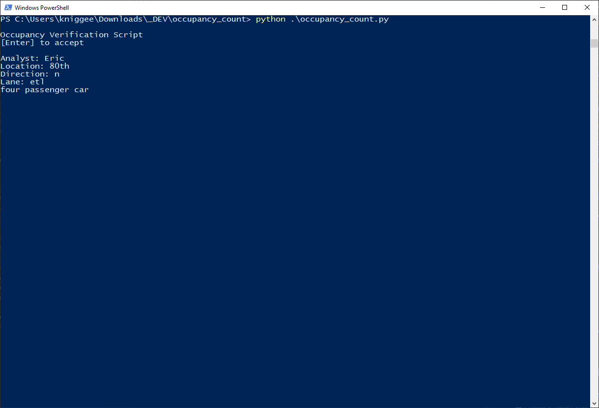
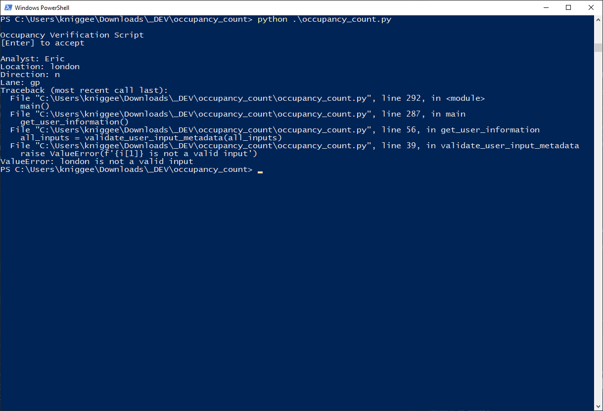
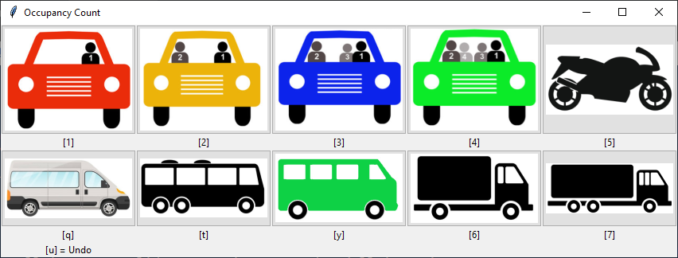
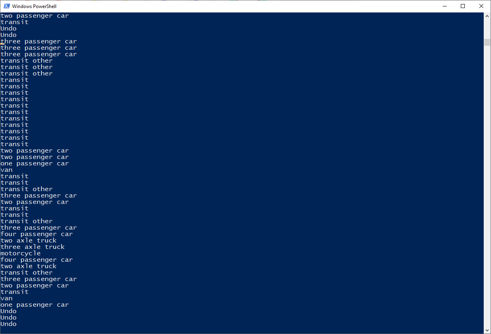

# Introduction
This is Python based tool with Tkinter UI for collecting transportation occupancy data. The tool works with input from touch, input device, or using the keyboard shortcuts. Log files record all actions taken by users, and the summary script exports a csv file of the results. 

# Run the Tool
Running the tool requires `Python 3+` and the `Pandas` library. If there are any other missing libraries they can be installed using the python package manager with the following command. 
```
pip install [package]
```

## Configuration
The `configuration.json` file contains the configuration parameters for the script. The table below describes the JSON name used in the script. If you want to modify a parameter such as changing the single occupant passenger car `one_passenger_car` to `a` update the file as follows.
```
{
"keyboard_shortcuts": {
    "one_passenger_car": "a",
    "two_passenger_car": "2",
...
```

You can also make changes to the way data is stored. For example, you could change the single occupant passenger car storage value from the default of `P1` to `Passenger1`.

```
...
"data_parameters": {
    "one_passenger_car": "Passenger1",
    "two_passenger_car": "P2",
    "three_passenger_car": "P3",
...
```

## Keyboard Shortcuts
 JSON name | Shortcut | 
--- | --- | 
one_passenger_car | Single occupant passenger car
two_passenger_car | Two occupant passenger car
three_passenger_car | Three occupant passenger car
four_passenger_car| Four occupant passenger car
motorcycle| Motorcycle
two_axle_truck | Two axle truck 
three_axle_truck | Three axle truck
van | Passenger or work van
transit| Transit vehicle with government agency branding
transit_other | Non-governmental transit vehicle
undo | Undo last action 

## Starting the Script
To run the script enter the following in the command prompt
```
python occupancy_count.py
```

In the command prompt you will be required to enter a few fields to record who collected the data and where. 


If you enter an invalid field you will get an error


If you want to make changes which fields are validated and how information is checked make updates to the `validate_user_input_metadata` function.

Start the collection process. You may enter data using an input device such as touch, keyboard, or using the shortcuts listed below each data field.



You can also monitor the system using the command window. It displays all actions taken by the operator. 



When you are down simply close out the collection window.


## Extract Data
To extract data to a csv `all_data_extracted.csv` file, run the other script that comes with this module. This file reads all logs in the collection directory, extracts the relevant information, and outputs the results to a csv file. 

```
python extract_log_data.py
```

## Summarize Data
You can create a summary spreadsheet, `summary_results.xlsx`, if you utilize the `summarize_log_data.py` script. This summary closely matches what was done in previous years. The output creates a workbook with two worksheets, one for a data summary, and the other for an AM/PM summary for each type of vehicle.

```
python summarize_log_data.py
```
